# 小学智能学习助手 (Elementary Learning Agent)

> 基于 AI 的自适应学习系统,通过错误感知追踪、个性化教学和间隔重复算法,帮助小学生高效掌握语文、数学、英语知识。

[](https://www.python.org/)
[](LICENSE)

---

## 📖 这是什么?

一个智能学习助手,帮助家长辅导小学生学习。**家长只需反馈测试结果,AI 自动追踪每个知识点的掌握情况,生成个性化教学内容,并智能安排复习计划。**

### 工作流程图

```mermaid
graph LR
    A[👤 家长创建任务<br/>背诵静夜思] --> B[🤖 AI 分解知识点<br/>诗句×4 + 作者 + 朝代]
    B --> C[📝 生成学习计划<br/>今天测试全部]
    C --> D[👤 家长反馈结果<br/>诗句对,作者朝代忘了]
    D --> E[📊 AI 分析错误<br/>朝代:错误1次<br/>作者:错误1次]
    E --> F[🎓 生成教学内容<br/>记忆技巧+口诀]
    F --> G[📅 安排复习<br/>明天再测]
    G --> H{连续3次正确?}
    H -->|否| D
    H -->|是| I[✅ 已掌握<br/>7天后抽查]
    
    style A fill:#e1f5ff
    style D fill:#e1f5ff
    style E fill:#fff3e0
    style F fill:#f3e5f5
    style I fill:#e8f5e9
```



### 核心价值

- 🎯 **细粒度追踪**: 不是简单的"会/不会",而是独立追踪每个知识点
- 🧠 **自适应教学**: 错误越多,教学越详细,复习越频繁
- 📅 **科学复习**: 基于 SM-2 + 艾宾浩斯遗忘曲线,优化长期记忆
- 🤖 **全自动化**: 家长只需反馈结果,其他全部自动完成

## ✨ 核心特性

- 🎯 **细粒度知识点追踪** - 独立追踪每个知识点的掌握情况
- 🧠 **自适应教学策略** - 根据错误次数自动调整教学方法
- 📅 **智能间隔重复** - 使用科学的复习算法优化长期记忆
- 📊 **自动学习报告** - 每日计划和每周总结自动生成
- 💬 **Slack 交互界面** - 家长友好的聊天式操作

## 🎬 快速演示

```
👤 家长 → #语文-学习:
"新任务:背诵《静夜思》,包括作者和朝代"

🤖 语文Agent:
"✅ 已创建任务:背诵《静夜思》
📚 知识点(共6项):诗句×4 + 朝代 + 作者
📅 建议今天完成初次测试"

---

👤 家长:
"测试完成:诗句都对,作者朝代记不住"

🤖 语文Agent:
"📊 掌握情况:
  ✅ 诗句:4/4 已掌握
  ❌ 朝代:需加强(错误1次)
  ❌ 作者:需加强(错误1次)

📝 针对性教学:
【朝代:唐】记忆技巧:唐朝是诗歌黄金时代
【作者:李白】口诀:静夜思,李白写,举头望月思故乡

⏰ 明天复习:只测作者和朝代"
```

## 🏗️ 系统架构

### 架构设计图

```mermaid
graph TB
    subgraph "交互层"
        A[Slack Workspace]
        A1[#语文-学习]
        A2[#数学-学习]
        A3[#英语-学习]
        A4[#学习-总览]
        A --> A1
        A --> A2
        A --> A3
        A --> A4
    end
    
    subgraph "OpenClaw 框架层"
        B[Gateway<br/>消息路由]
        C[Scheduler<br/>定时任务]
        B --> C
    end
    
    subgraph "Agent 层 (YAML 配置)"
        D1[语文 Agent<br/>System Prompt]
        D2[数学 Agent<br/>System Prompt]
        D3[英语 Agent<br/>System Prompt]
        D4[协调器 Agent<br/>System Prompt]
    end
    
    subgraph "Skills 层 (Python 实现)"
        E1[task_manager<br/>任务管理]
        E2[adaptive_teaching<br/>自适应教学]
        E3[progress_tracker<br/>进度追踪]
        E4[spaced_repetition<br/>间隔重复算法]
    end
    
    subgraph "数据层"
        F[(SQLite/PostgreSQL<br/>结构化存储)]
        F1[Tasks 任务表]
        F2[KnowledgePoints 知识点表]
        F3[LearningHistory 学习历史]
        F --> F1
        F --> F2
        F --> F3
    end
    
    subgraph "AI 层"
        G[Claude 3.5 Sonnet<br/>GPT-4]
    end
    
    A1 --> B
    A2 --> B
    A3 --> B
    A4 --> B
    
    B --> D1
    B --> D2
    B --> D3
    B --> D4
    
    D1 --> E1
    D1 --> E2
    D2 --> E1
    D2 --> E3
    D3 --> E4
    D4 --> E3
    
    E1 --> F
    E2 --> F
    E3 --> F
    E4 --> F
    
    D1 --> G
    D2 --> G
    D3 --> G
    D4 --> G
    
    C -.每天8点.-> D4
    C -.每周日8点.-> D4
    
    style A fill:#e3f2fd
    style B fill:#fff3e0
    style C fill:#fff3e0
    style D1 fill:#f3e5f5
    style D2 fill:#f3e5f5
    style D3 fill:#f3e5f5
    style D4 fill:#f3e5f5
    style E1 fill:#e8f5e9
    style E2 fill:#e8f5e9
    style E3 fill:#e8f5e9
    style E4 fill:#e8f5e9
    style F fill:#fce4ec
    style G fill:#fff9c4
```



### 分层职责

| 层级 | 职责 | 实现方式 |
|------|------|---------|
| **交互层** | Slack 消息收发 | Slack Workspace + Channels |
| **OpenClaw 层** | 消息路由、Agent 管理、定时任务 | OpenClaw 框架 (开箱即用) |
| **Agent 层** | 定义 AI 行为、System Prompt | YAML 配置文件 |
| **Skills 层** | 核心业务逻辑、算法实现 | Python 代码 (需要实现) |
| **数据层** | 结构化数据存储、复杂查询 | SQLite/PostgreSQL |
| **AI 层** | 自然语言理解和生成 | Claude/GPT API |

## 🚀 快速开始

### 方式 1: Docker 部署 (推荐)

```bash
# 克隆项目
git clone https://github.com/youkuang/elementary-learning-agent.git
cd elementary-learning-agent

# 配置环境变量
cp .env.example .env
# 编辑 .env 填入 Slack Token 和 AI API Key

# 启动
docker-compose up -d

# 查看日志
docker-compose logs -f
```

详细的 Docker 部署指南请查看 [docs/DOCKER_DEPLOYMENT.md](docs/DOCKER_DEPLOYMENT.md)

### 方式 2: 本地安装

#### 1. 环境要求

- Python 3.10+
- Docker & Docker Compose (推荐)
- Slack Workspace (免费版即可)
- Claude API Key 或 OpenAI API Key

#### 2. 安装

```bash
# 克隆项目
git clone https://github.com/youkuang/elementary-learning-agent.git
cd elementary-learning-agent

# 创建虚拟环境
python3 -m venv venv
source venv/bin/activate  # Windows: venv\Scripts\activate

# 安装依赖
pip install -r requirements.txt

# 安装 OpenClaw
git clone https://github.com/openclaw/openclaw.git
cd openclaw
pip install -e .
cd ..
```

#### 3. 配置

```bash
# 复制环境变量模板
cp .env.example .env

# 编辑 .env 文件,填入:
# - SLACK_BOT_TOKEN
# - ANTHROPIC_API_KEY (或 OPENAI_API_KEY)
```

详细的 Slack 配置步骤请查看 [docs/SLACK_SETUP.md](docs/SLACK_SETUP.md)

#### 4. 初始化数据库

```bash
python scripts/init_db.py
```

#### 5. 启动系统

```bash
# 使用 OpenClaw 启动
openclaw start --config openclaw_config.yaml

# 或使用 Python
python main.py
```

详细的 OpenClaw 配置步骤请查看 [docs/OPENCLAW_SETUP.md](docs/OPENCLAW_SETUP.md)

## 📁 项目结构

```
elementary-learning-agent/
├── agents/                    # Agent 配置 (YAML)
│   ├── __init__.py
│   ├── chinese_tutor.yaml     # 语文 Agent 配置
│   ├── math_tutor.yaml        # 数学 Agent 配置
│   ├── english_tutor.yaml     # 英语 Agent 配置
│   └── coordinator.yaml       # 协调器 Agent 配置
├── skills/                    # 自定义技能 (Python)
│   ├── __init__.py
│   ├── task_manager.py        # 任务管理
│   ├── adaptive_teaching.py   # 自适应教学
│   ├── progress_tracker.py    # 进度追踪
│   └── spaced_repetition.py   # 间隔重复算法
├── database/                  # 数据库
│   ├── __init__.py
│   ├── schema.sql             # 数据库结构
│   ├── db_manager.py          # 数据库管理
│   └── models.py              # 数据模型
├── config/                    # 配置
│   ├── __init__.py
│   └── config.py              # 配置管理
├── scripts/                   # 工具脚本
│   └── init_db.py             # 数据库初始化
├── tests/                     # 测试
│   └── __init__.py
├── docs/                      # 文档
│   ├── DESIGN.md              # 系统设计文档
│   ├── SLACK_SETUP.md         # Slack 配置指南
│   └── OPENCLAW_SETUP.md      # OpenClaw 配置指南
├── data/                      # 数据目录
├── logs/                      # 日志目录
├── openclaw_config.yaml       # OpenClaw 主配置
├── requirements.txt           # Python 依赖
├── .env.example               # 环境变量模板
├── .gitignore
├── main.py                    # 主程序入口
└── README.md
```

## 📚 使用指南

### 创建学习任务

在对应的 Slack 频道发送消息:

**语文:**
```
新任务:第三单元生词 你我他天地人
新任务:背诵《静夜思》,包括作者和朝代
```

**数学:**
```
新任务:九九乘法表 7的倍数
新任务:20以内加减法
```

**英语:**
```
新任务:Unit 3 单词 apple banana orange
```

### 反馈测试结果

```
测试完成:你他天地人都对,我写错了
测试完成:诗句全对,作者朝代记不住
测试完成:7×8 总是算错
```

### 查看进度

```
任务进度
本周报告
```

## 🧠 核心算法

### 间隔重复算法

```python
错误次数 = 1:  明天复习
错误次数 = 2:  今天晚些时候 + 明天
错误次数 ≥ 3:  增加复习频率,降低难度

连续2次正确:  3天后复习
连续3次正确:  标记为"已掌握",7天后抽查
```

### 自适应教学策略

```python
错误1次:  基础讲解 + 记忆技巧
错误2次:  多种方法 + 关联知识点
错误3次+: 综合教学 + 拆分难度 + 高频复习
```

## 🛠️ 技术栈

**核心框架:**
- **OpenClaw**: Agent 框架、Slack 集成、消息路由、定时任务
- **Python 3.10+**: 业务逻辑实现

**AI 层:**
- **Claude 3.5 Sonnet / GPT-4**: AI 模型

**数据层:**
- **SQLite (本地) / PostgreSQL (云端)**: 结构化数据存储
- **SQLAlchemy**: ORM

**核心库:**
- anthropic, openai - AI API
- pydantic - 数据验证
- loguru - 日志

## 📊 数据隐私

- ✅ 所有学习数据存储在本地/私有服务器
- ✅ 不会上传学生个人信息到第三方
- ✅ AI API 调用仅发送学习内容,不含身份信息

## 🤝 贡献

欢迎提交 Issue 和 Pull Request!

## 📄 许可证

MIT License

## 🙏 致谢

- [OpenClaw](https://github.com/openclaw/openclaw) - Agent 框架
- [Anthropic](https://www.anthropic.com/) - Claude AI
- [Slack](https://slack.com/) - 消息平台

---

⭐ 如果这个项目对你有帮助,请给个 Star!
